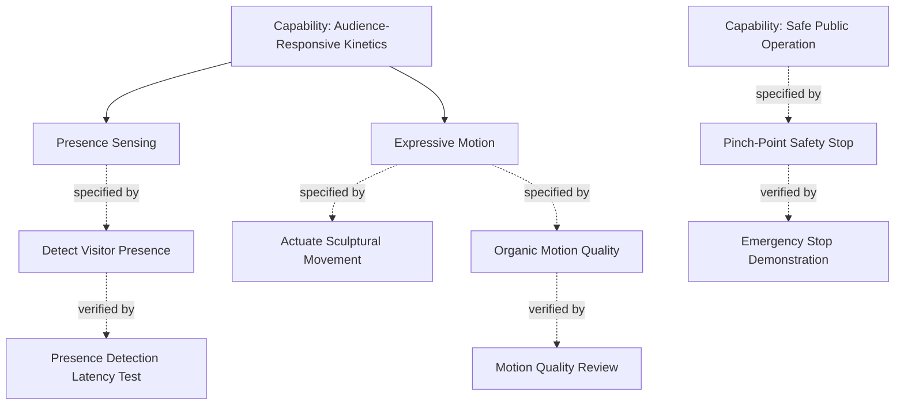

# EverydayDynamics — Systems Model

The systems-engineering model for **EverydayDynamics**, a robotics-art effort.
This repository tracks *what the pieces should do and be*, and proves it: the
artistic intent, the requirements that flow from it, the interfaces between
subsystems, and how each requirement is verified.

It is **AI-native** by construction: the whole model is plain Markdown in git,
so an AI agent can read it, reason over traceability, and propose edits — while
everything stays human-readable and diffable. See [`CLAUDE.md`](CLAUDE.md) for
the schema and workflow an agent (or a person) follows.

## Tooling

The model uses [reqvire](https://github.com/reqvire-org/reqvire), a Markdown-in-git
MBSE tool. It runs with **no install** via `npx`; you only need Node.

```bash
make validate     # check structure & relations (run before every commit)
make coverage     # which requirements are verified, and the gaps
make traces       # verification traces up to capabilities
make serve        # browse the model in the Explorer UI at :8080
make check        # validate + lint
```

(Or call reqvire directly: `npx -y @reqvire-org/reqvire@latest --workspace "$PWD" <cmd>`.)

## Layout

```
system-model/               # the model — reqvire parses everything here
  Capabilities.md           #   what the system can do (user-story form)
  Requirements/             #   testable "shall" statements, EARS form
    SystemRequirements.md
    ExperienceRequirements.md   # artistic intent as measurable constraints
    SafetyRequirements.md
  Verifications/            #   how requirements are proven satisfied
    Verifications.md
decisions/                  # ADRs — architecture/tooling decisions (not parsed)
notes/                      # scratch/working docs (not parsed)
CLAUDE.md                   # the agent contract: schema, relations, workflow
```

The seeded model is a small **worked example** — one flagship piece (an
audience-responsive kinetic sculpture) modeled end to end from capability →
requirement → verification — so every relation type is demonstrated and
`reqvire validate` passes. Replace/extend it with your real pieces.

## The model at a glance



## AI agents

Reqvire ships an MCP server. Start it with `make mcp` and Claude Code will pick
up the `reqvire` server from [`.mcp.json`](.mcp.json), giving the agent typed
tools to query and (with `--enable-mutations`) edit the model. Either way, an
agent editing files directly should follow [`CLAUDE.md`](CLAUDE.md) and finish
with `make check`.
